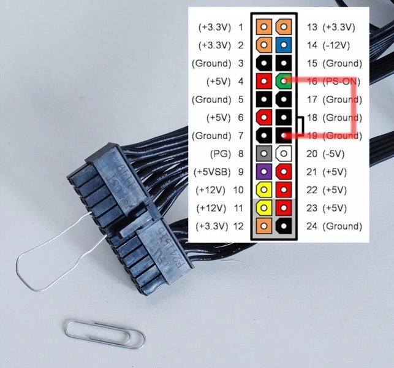

# 🔌 Руководство по запуску БП ATX

Данный репозиторий содержит простую инструкцию по запуску компьютерного блока питания стандарта ATX без подключения к материнской плате. Это полезно для проверки работоспособности БП или питания кастомных проектов.

---

## 🇷🇺 Русская версия

### 🛑 ВНИМАНИЕ! ОТКАЗ ОТ ОТВЕТСТВЕННОСТИ
Все действия вы выполняете на свой страх и риск. Неправильное подключение может привести к выходу оборудования из строя или поражению электрическим током.
* Убедитесь, что БП отключен от сети 220В перед установкой перемычки.
* Рекомендуется подключать к БП хотя бы минимальную нагрузку (например, вентилятор), так как некоторые модели могут не запуститься без нагрузки.

### 📎 Описание метода "Скрепки"
Для запуска блока питания необходимо замкнуть контакт **PS-ON** (Power Supply On) на любой контакт **Ground** (земля).

### Инструменты и шаги
1. **Инструменты:** Блок питания и металлическая скрепка (или провод).
2. **Подготовка:** Согните скрепку в форме буквы "U".
3. **Подключение:** 
    * Найдите **Пин 16** (зеленый провод, PS-ON).
    * Вставьте один конец скрепки в него, а второй - в любой **черный провод** (Ground, например, пины 15 или 17).
4. **Проверка:** Подключите БП к сети. Если вентилятор закрутился - всё работает.

### Схема контактов
| Контакт | Цвет провода | Назначение |
|---|---|---|
| **Pin 16** | Зеленый | PS-ON (Запуск) |
| **Pin 15/17** | Черный | COM / Ground (Земля) |

---

### ⚠️ Условия использования

* **Личное использование:** Инструкции предоставляются бесплатно для частного ознакомления.
* **Авторство:** При цитировании или копировании материалов ссылка на данный репозиторий обязательна.
* **Запрет коммерции:** Запрещается продажа данных материалов или их использование в платных курсах без согласия автора.
* **Риски:** Все действия вы выполняете на свой страх и риск. Автор не несет ответственности за порчу имущества, травмы или иные последствия, возникшие в ходе следования инструкции.
* **Как есть:** Информация предоставляется «как есть» (as is). Автор не гарантирует пригодность инструкций для ваших конкретных целей.

---

**Авторские права © 2026 [Иван Бирючков / https://github.com/biryuchkov-ia]**

---

## 🇺🇸 English Version

# 🔌 ATX Power Supply Jumpstart Guide

This repository provides a simple guide on how to start an ATX power supply without a motherboard. This is useful for testing the PSU or powering DIY projects.

### 🛑 WARNING! DISCLAIMER
Perform these actions at your own risk. Incorrect wiring can damage equipment or cause electric shock.
* Ensure the PSU is unplugged from the AC outlet before inserting the jumper.
* It is recommended to connect a small load (e.g., a fan) as some PSUs won't start without a minimum load.

### 📎 The "Paperclip Method"
To turn on the power supply, you must short the **PS-ON** (Power Supply On) pin to any **Ground** (COM) pin.

### Steps to Follow
1. **Tools:** ATX Power Supply and a metal paperclip (or a jumper wire).
2. **Preparation:** Bend the paperclip into a "U" shape.
3. **Connection:**
    * Locate **Pin 16** (Green wire, PS-ON).
    * Insert one end of the paperclip into Pin 16 and the other end into any **Black wire** (Ground, e.g., Pins 15 or 17).
4. **Test:** Plug the PSU into the wall and turn on the switch. If the fan starts spinning, the PSU is active.

### Pinout Table
| Pin | Wire Color | Description |
|---|---|---|
| **Pin 16** | Green | PS-ON (Power On) |
| **Pin 15/17** | Black | COM / Ground |

---

### ⚠️ Terms of Use

* **Personal Use:** These instructions are provided free of charge for personal reference only.
* **Attribution:** When quoting or copying materials, a link to this repository is required.
* **No Commercial Use:** Selling these materials or using them in paid courses without the author's consent is prohibited.
* **Risk:** You perform all actions at your own risk. The author is not liable for any property damage, injuries, or other consequences arising from following these instructions.
* **As Is:** Information is provided "as is". The author does not guarantee that these instructions are suitable for your specific purposes.

---

**Copyright © 2026 [Ivan Biryuchkov / https://github.com/biryuchkov-ia]**

---